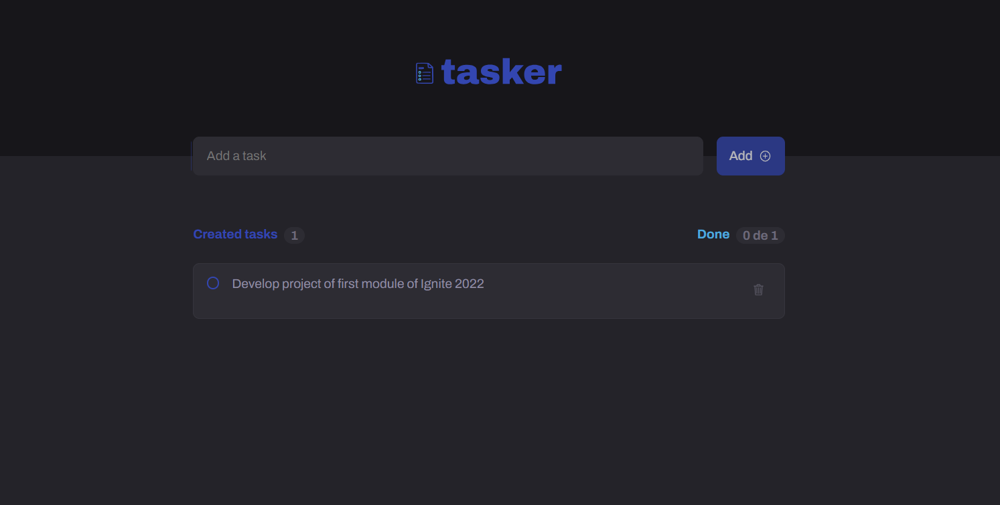

<p align="center">
  
</p>

<p align="center">
  
</p>

<strong align="center">
  Tasker is an application to create and follow tasks that you would like to do and that will help you to achieve your goals.
</strong>

<p align="center">
  

  

  
</p>

<p align="center">
  👉🏻 Access: 
  <a
    href="https://belapferreira.github.io/tasker/"
    target="_blank"
    rel="noopener noreferrer"
  >
    https://belapferreira.github.io/tasker/
  </a>
</p>

<p align="center">
  <a href="#features">Features</a>&nbsp;&nbsp;&nbsp;|&nbsp;&nbsp;&nbsp;
  <a href="#heavy_check_mark-settings">Settings</a>&nbsp;&nbsp;&nbsp;|&nbsp;&nbsp;&nbsp;
  <a href="#arrow_down_small-cloning-the-repository">Cloning the repository</a>&nbsp;&nbsp;&nbsp;|&nbsp;&nbsp;&nbsp;
  <a href="#beginner-starting-the-application">Starting the application</a>&nbsp;&nbsp;&nbsp;|&nbsp;&nbsp;&nbsp;
  <a href="#wrench-techs--tools--resources">Techs | Tools | Resources</a>&nbsp;&nbsp;&nbsp;|&nbsp;&nbsp;&nbsp;
  <a href="#memo-license">License</a>
</p>

### Features

- Add task;
- Remove task;
- Mark a task as finished and unmark it;
- Save tasks registered in the local storage;
- Responsive page.

### :heavy_check_mark: Settings

The settings to execute the application in your computer are listed below.

- [Git](https://git-scm.com);
- [Node](https://nodejs.org/);
- [NPM](https://www.npmjs.com/).

### :arrow_down_small: Cloning the repository

1. Through the terminal, go to the directory where you want to have the repository cloned and run the following command:

```bash
# cloning the repository
git clone https://github.com/belapferreira/tasker
```

### :beginner: Starting the application

1. Through the terminal, go to the directory where the repository was cloned and run the following command:

```bash
# installing dependencies
npm install

# starting application
npm run dev
```

### :wrench: Techs | Tools | Resources

This project was developed using the following resources:

-  [CSS Modules](https://github.com/css-modules/css-modules);
-  [Eslint](https://eslint.org/);
-  [Radix UI Checkbox](https://www.radix-ui.com/docs/primitives/components/checkbox);
-  [React](https://pt-br.reactjs.org/);
-  [React DOM](https://pt-br.reactjs.org/docs/react-dom.html);
-  [React Icons](https://react-icons.github.io/react-icons/);
-  [React Router Dom](https://reactrouter.com/web/guides/quick-start);
-  [TypeScript](https://www.typescriptlang.org/);
-  [Uuid](https://github.com/uuidjs/uuid);
-  [Vite](https://vitejs.dev/).

### :memo: License

This project is under MIT license. See [LICENSE](https://github.com/belapferreira/tasker/blob/master/LICENSE) for more information.

---

Developed by Bela Ferreira :blue_heart: Contact: https://www.linkedin.com/in/belapferreira :blush:
